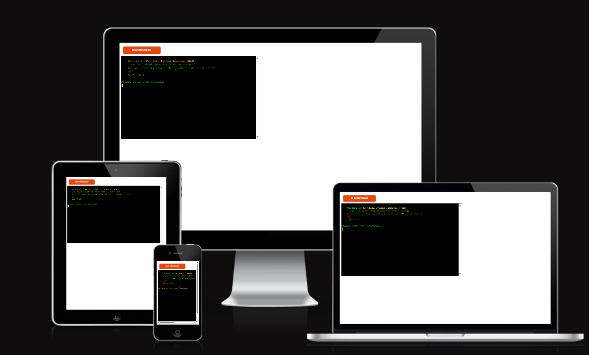
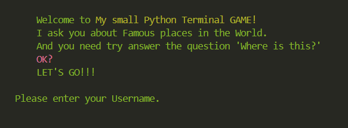
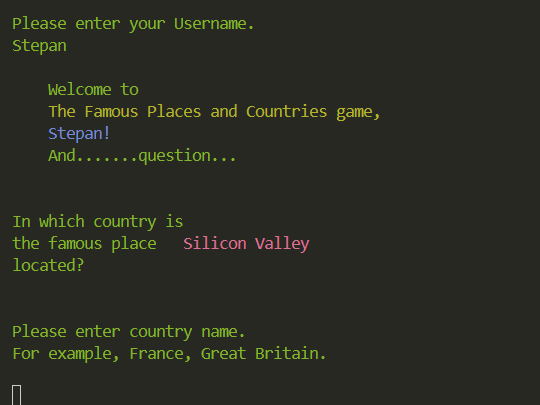
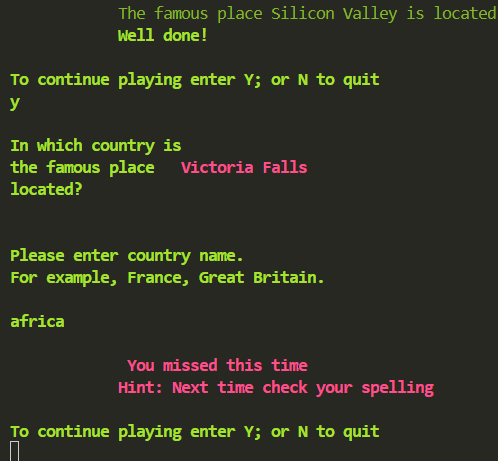
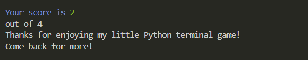

# Terminal Game Famous Places and Countries Quiz

*The link to [Famous Places and Countries Quiz](https://famous-places-75dcf37b0e17.herokuapp.com/)*

The Famous Places and Countries game is an interactive educational quiz designed to help users learn about famous places and countries around the world and test their knowledge of them.

---

## How to play:

  1. Press the orange button - ‘Start the program’ and the terminal window will open. 
  1. We are greeted with a welcome speech. .
  1. After entering your username, you can start playing the game.
  1. You have 10 questions.
  1. And so we get the first question about the Most Famous Place in the World and we have to guess in which country it is located. 
  1. 
  1. The game is to write the correct country where the Famous Place is located. You will receive a message from the game for your answer. 
  1. 
  1. At the end of the game, you will receive statistics on your correct answers.
  1. 

---

## User Experience

### First-Time User Experience

Users visiting the site for the first time are offered a simple and intuitive process for setting up their gaming preferences. Clear instructions and an easy-to-navigate interface ensure a seamless experience.

### Returning User

Returning users

### User Stories (PP4 & PP5)

- As a potential client, I want to understand the expertise of the developer in creating interactive and educational games.
- As a visitor, I want a visually appealing and easy-to-navigate site.
- As a user interested in educational games, I want detailed information about each feature and how to use it.

---

## Features
  
- **Interactive gameplay**: Users can guess the names of various landmarks.
- **Instant feedback**: Users receive feedback on their answers.
- **Global places**: The game features a diverse set of landmarks from around the world.

---

## Technologies Used

### Languages:

- [Python 3.8.5](https://www.python.org/downloads/release/python-385/): used to anchor the project and direct all application behavior

- [JavaScript](https://www.javascript.com/): used to provide the start script needed to run the Code Institute mock terminal in the browser

- [HTML](https://developer.mozilla.org/en-US/docs/Web/HTML) used to construct the elements involved in building the mock terminal in the browser

- [GIMP](https://www.gimp.org/) was used to make and resize images for the README file.

- [Python tutorials](https://www.w3schools.com/python) was used about tutorials for Python

### Frameworks/Libraries, Programmes and Tools:
#### Python modules/packages:

##### Standard library imports:

- [random](https://docs.python.org/3/library/random.html) was used to implement pseudo-random number generation.
- [os](https://docs.python.org/3/library/os.html ) was used to clear the terminal before running the program.

##### Third-party imports:

- [Simple Terminal Menu](https://pypi.org/project/simple-term-menu/) was used to implement the menu.
- [Colorama](https://pypi.org/project/colorama/) was used to add colors and styles to the project.

#### Other tools:

- [VSCode](https://code.visualstudio.com/) was used as the main tool to write and edit code.
- [Git](https://git-scm.com/) was used for the version control of the website.
- [GitHub](https://github.com/) was used to host the code of the website.
- [Node.js](https://nodejs.org/) and npm (if using JavaScript/Node for frontend or backend)
- [Heroku CLI](https://devcenter.heroku.com/articles/heroku-cli) for deployment

---

## Deployment

- The program was deployed to [Heroku](https://dashboard.heroku.com).

---
## Credits

### Content and text

* Main information from [Youtube video for example](https://www.youtube.com/watch?v=zehwgTB0vV8)
* Many info  [Build a Quiz Application With Python](https://realpython.com/python-quiz-application/)

### Media

* Open sites and sources of images and emblems
* Code institute for the deployment process
* Translated with www.DeepL.com/Translator and Grammarly for Windows

### Acknowledgements
* Special thanks to [Laura Mayock](https://www.linkedin.com/in/laura-mayock/) and [Julia Konovalova](https://github.com/IuliiaKonovalova) for the call and conversation that helped me, after the first unsuccessful attempt, to find the strength in the first place and to understand my shortcomings in the project and complete it. 
* Code Institute tutors and Slack community members for their support and help.

---

Happy coding!
