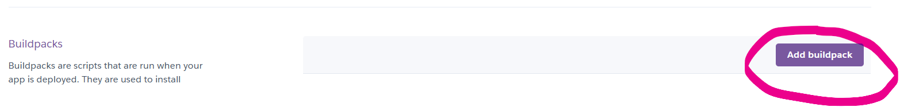

# Terminal Game Famous Places and Countries Quiz

*The link to [Famous Places and Countries Quiz](https://famous-places-75dcf37b0e17.herokuapp.com/)*

The Famous Places and Countries game is an interactive educational quiz designed to help users learn about famous places and countries around the world and test their knowledge of them.

---

## How to play:

  1. Press the orange button - ‘Start the program’ and the terminal window will open. 
  1. We are greeted with a welcome speech.
  1. .
  1. After entering your username, you can start playing the game.
  1. You have 10 questions.
  1. And so we get the first question about the Most Famous Place in the World and we have to guess in which country it is located. 
  1. 
  1. The game is to write the correct country where the Famous Place is located. You will receive a message from the game for your answer. 
  1. 
  1. At the end of the game, you will receive statistics on your correct answers.
  1. 

---

## User Experience

### First-Time User Experience

Users visiting the site for the first time are offered a simple and intuitive process for setting up their gaming preferences. Clear instructions and an easy-to-navigate interface ensure a seamless experience.

### Returning User

Returning users

### User Stories 

- As a potential client, I want to understand the expertise of the developer in creating interactive and educational games.
- As a user interested in educational games, I want detailed information about each feature and how to use it.

---

## Features
  
- **Default user name**: if the user has not entered his name, then we assign him Superuser.
- **Interactive gameplay**: Users can guess the names of various landmarks.
- **Instant feedback**: Users receive feedback on their answers.
- **Global places**: The game features a diverse set of landmarks from around the world.

---

## Future improvements
- **Leaderboard**: Add a scoring system and leaderboard.
- **Additional locations**: Add more locations to increase the difficulty of the game.
- **Hints**: Add hints for each landmark.

---

## Technologies Used

### Languages:

- [Python](https://www.python.org/downloads/release/python-385/): used to anchor the project and direct all application behavior

- [JavaScript](https://www.javascript.com/): used to provide the start script needed to run the Code Institute mock terminal in the browser

- [GIMP](https://www.gimp.org/) was used to make and resize images for the README file.

### Frameworks/Libraries, Programmes and Tools:
#### Python modules/packages:

##### Standard library imports:

- [random](https://docs.python.org/3/library/random.html) was used to implement pseudo-random number generation.
- [os](https://docs.python.org/3/library/os.html ) was used to clear the terminal before running the program.
- [time](https://docs.python.org/3/library/time.html ) was used to breack the terminal for short waiting.

##### Third-party imports:

- [Colorama](https://pypi.org/project/colorama/) was used to add colors and styles to the project.

#### Other tools:

- [VSCode](https://code.visualstudio.com/) was used as the main tool to write and edit code.
- [Git](https://git-scm.com/) was used for the version control of the website.
- [GitHub](https://github.com/) was used to host the code of the website.
- [Heroku CLI](https://devcenter.heroku.com/articles/heroku-cli) for deployment

---

## Deployment

- The program was deployed to [Heroku](https://dashboard.heroku.com).

### To deploy the project as an application that can be **run locally**:

*Note:*
  1. This project requires you to have Python installed on your local PC:
  - `pip install python`

  1. You will also need pip installed to allow the installation of modules the application uses.
  - `pip install python3-pip`

Create a local copy of the GitHub repository by following one of the two processes below:

- Download ZIP file:
  1. Go to the [GitHub Repo page](https://github.com/lazoriks/FamousPlaces_Country_QuizPP3).
  1. Click the Code button and download the ZIP file containing the project.
  1. Extract the ZIP file to a location on your PC.

- Clone the repository:
  1. Open a folder on your computer with the terminal.
  1. Run the following command
  - `git clone https://github.com/lazoriks/FamousPlaces_Country_QuizPP3.git`

- Alternatively, if using Gitpod, you can click below to create your own workspace using this repository.

  

  1. Install Python module dependencies:
     
      1. Navigate to the folder madlib_with_python by executing the command:
      - `cd FamousPlaces_Country_QuizPP3`
      1. Run the command pip install -r requirements.txt
        - `pip install -r requirements.txt`      

### To deploy the project to Heroku so it can be run as a remote web application:
- Clone the repository:
  1. Open a folder on your computer with the terminal.
  1. Run the following command
  - `git clone https://github.com/lazoriks/FamousPlaces_Country_QuizPP3.git`

  1. Create your own GitHub repository to host the code.
  1. Run the command `git remote set-url origin <Your GitHub Repo Path>` to set the remote repository location to your repository.

  1. Push the files to your repository with the following command:
  `git push`
  1. Create a Heroku account if you don't already have one here [Heroku](https://dashboard.heroku.com).
  1. Create a new Heroku application on the following page here [New Heroku App](https://dashboard.heroku.com/apps):

      - 

  1. Go to the Deploy tab:

      - 

  1. Link your GitHub account and connect the application to the repository you created.

      - 

  1. Go to the Settings tab:
  
      - 

  1. Click "Add buildpack":

      - 

  1. Add the Python and Node.js buildpacks in the following order:

      - 

  1. Click "Reveal Config Vars."

      - 

  1. Add 1 new Config Vars:
      - Key: PORT Value: 8000
      - *This Config was provided by [CODE INSTITUTE](https://codeinstitute.net/)*.

  1. Go back to the Deploy tab:

      - 

  1. Click "Deploy Branch":

      - 

      - Wait for the completion of the deployment.

      - 

  1. Click "Open app" to launch the application inside a web page.

      - 

---
## Credits

### Content and text

* Main information from [Youtube video for example](https://www.youtube.com/watch?v=zehwgTB0vV8)
* Many info  [Build a Quiz Application With Python](https://realpython.com/python-quiz-application/)

### Media

* Open sites and sources of images and emblems
* Code institute for the deployment process
* Translated with www.DeepL.com/Translator and Grammarly for Windows

### Acknowledgements
* Special thanks to [Julia Konovalova](https://github.com/IuliiaKonovalova) for the call and conversation that helped me, after the first unsuccessful attempt, to find the strength in the first place and to understand my shortcomings in the project and complete it. 
* Code Institute tutors and Slack community members for their support and help.

---

Happy coding!
